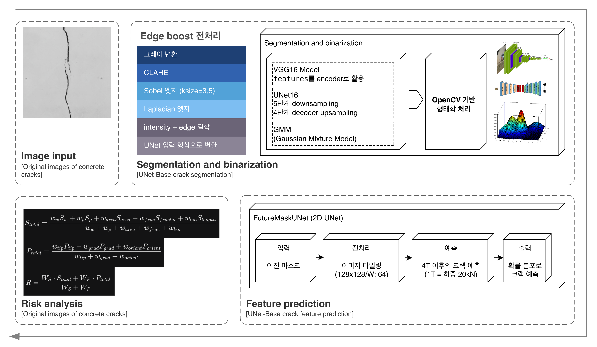

# UNet-Base Crack Future Risk Analysis Pipeline

_(UNet16 / VGG16 Model + Future-mask UNet All-in-one)_

스마트 건물 안전 관리를 위해 Vision &amp; AI 기술을 활용한 콘크리트 크랙 탐지 및 미래 위험도 예측 파이프라인

**Affiliation**

- 최시훈 (CHOI SIHUN)
- Department of Smart Convergence Engineering, Hanyang Univ. ERICA

**Contact**

- 📧 fkdldkrhya@hanyang.ac.kr

**Research Interests**

- AI / Computer Vision / Structural Health Monitoring

---

## System Pipeline

## Model

[https://drive.google.com/file/d/179Dj8soVz9lHpXySr8MEsgMi7aueb4ua/view?usp=sharing](https://drive.google.com/file/d/179Dj8soVz9lHpXySr8MEsgMi7aueb4ua/view?usp=sharing)

# LICENSE

BSD 2-Clause License

Copyright (c) 2023, CHOI SI-HUN

Redistribution and use in source and binary forms, with or without modification, are permitted provided that the following conditions are met:

Redistributions of source code must retain the above copyright notice, this list of conditions and the following disclaimer.

Redistributions in binary form must reproduce the above copyright notice, this list of conditions and the following disclaimer in the documentation and/or other materials provided with the distribution.

THIS SOFTWARE IS PROVIDED BY THE COPYRIGHT HOLDERS AND CONTRIBUTORS "AS IS" AND ANY EXPRESS OR IMPLIED WARRANTIES, INCLUDING, BUT NOT LIMITED TO, THE IMPLIED WARRANTIES OF MERCHANTABILITY AND FITNESS FOR A PARTICULAR PURPOSE ARE DISCLAIMED. IN NO EVENT SHALL THE COPYRIGHT HOLDER OR CONTRIBUTORS BE LIABLE FOR ANY DIRECT, INDIRECT, INCIDENTAL, SPECIAL, EXEMPLARY, OR CONSEQUENTIAL DAMAGES (INCLUDING, BUT NOT LIMITED TO, PROCUREMENT OF SUBSTITUTE GOODS OR SERVICES; LOSS OF USE, DATA, OR PROFITS; OR BUSINESS INTERRUPTION) HOWEVER CAUSED AND ON ANY THEORY OF LIABILITY, WHETHER IN CONTRACT, STRICT LIABILITY, OR TORT (INCLUDING NEGLIGENCE OR OTHERWISE) ARISING IN ANY WAY OUT OF THE USE OF THIS SOFTWARE, EVEN IF ADVISED OF THE POSSIBILITY OF SUCH DAMAGE.
